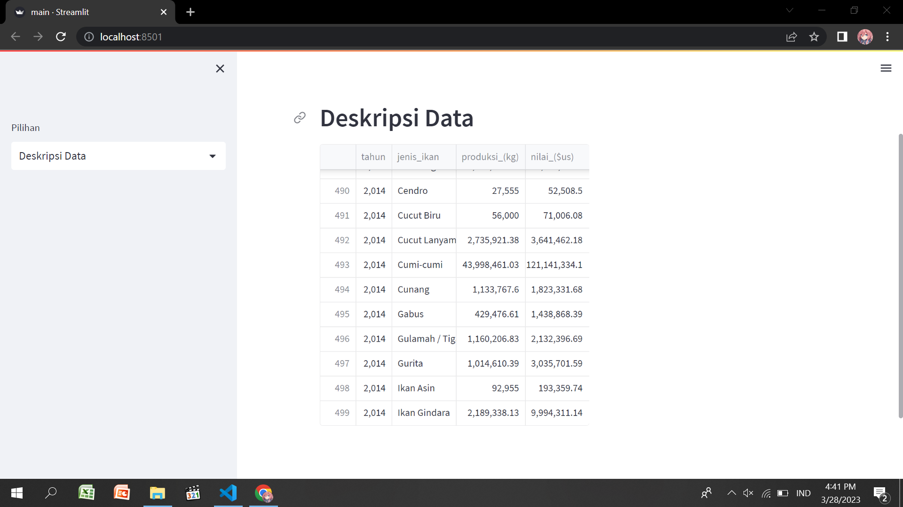
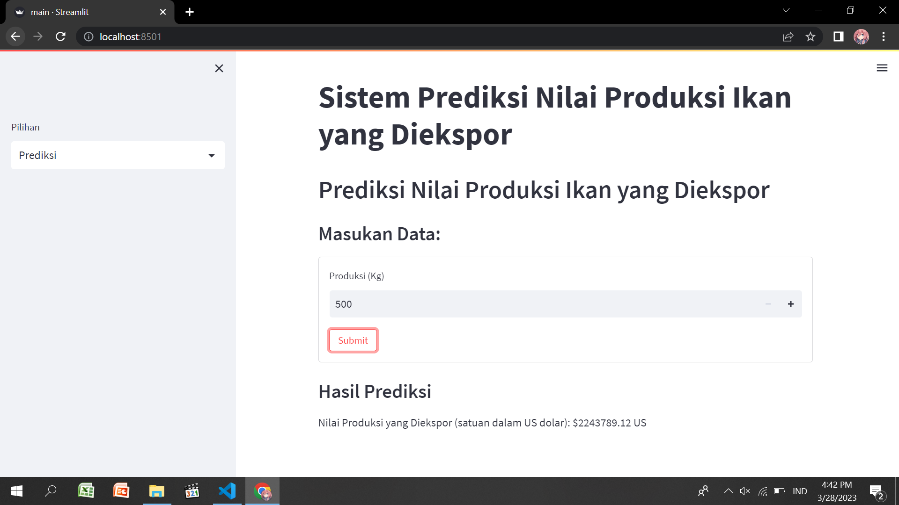

# **Sistem Prediksi Nilai Produksi Ikan yang Diekspor menggunakan metode Regresi Linier**

Berikut adalah langkah-langkah untuk membuat Sistem Prediksi Nilai Produksi Ikan yang Diekspor menggunakan metode Regresi Linier dengan bahasa pemrograman Python berdasarkan data yang diberikan:

1. Persiapkan dataset: Dataset yang digunakan terdiri dari 4 variabel yaitu tahun, jenis ikan, produksi dalam satuan Kg, dan nilai produksi dalam satuan US $. Pastikan dataset sudah bersih dari nilai yang hilang (missing value) atau data yang tidak konsisten.
2. Memuat dataset: Muat dataset tersebut ke dalam program Python menggunakan library pandas. Gunakan fungsi pandas.read_csv() untuk memuat dataset dari file CSV.
3. Melakukan analisis deskriptif: Lakukan analisis deskriptif pada dataset, termasuk statistik dasar, seperti mean, median, dan standar deviasi untuk masing-masing variabel, serta visualisasi data untuk melihat pola yang ada.
4. Membagi dataset menjadi data latih dan data uji: Bagi dataset menjadi data latih dan data uji. Data latih digunakan untuk melatih model prediksi, sedangkan data uji digunakan untuk menguji performa model.
5. Membuat model Regresi Linier: Buat model Regresi Linier menggunakan library scikit-learn. Gunakan fungsi LinearRegression() untuk membuat model regresi linier.
6. Melatih model: Latih model menggunakan data latih yang sudah dibagi sebelumnya. Gunakan fungsi fit() pada model Regresi Linier untuk melatih model.
7. Memprediksi nilai produksi ikan: Gunakan data uji untuk memprediksi nilai produksi ikan yang diekspor. Gunakan fungsi predict() pada model Regresi Linier untuk memprediksi nilai produksi ikan.
8. Evaluasi model: Evaluasi performa model dengan menghitung nilai MSE (Mean Squared Error) dan R-Squared.

Berikut adalah contoh kode Python untuk membuat Sistem Prediksi Nilai Produksi Ikan yang Diekspor menggunakan metode Regresi Linier:

```python
import streamlit as st
import pandas as pd
from sklearn.model_selection import train_test_split
from sklearn.linear_model import LinearRegression
from sklearn.metrics import mean_squared_error, r2_score

# Load dataset
df = pd.read_csv('data-nilai-eksport.csv')

# Set page title
st.title('Sistem Prediksi Nilai Produksi Ikan yang Diekspor')

# Set sidebar options
sidebar_options = ['Deskripsi Data', 'Prediksi']
sidebar_choice = st.sidebar.selectbox('Pilihan', sidebar_options)

# Deskripsi Data
if sidebar_choice == 'Deskripsi Data':
    st.header('Deskripsi Data')
    st.write(df.head(500))

# Prediksi
elif sidebar_choice == 'Prediksi':
    st.header('Prediksi Nilai Produksi Ikan yang Diekspor')

    # Split dataset into training and testing sets
    X_train, X_test, y_train, y_test = train_test_split(df[['produksi_(kg)']], df['nilai_($us)'], test_size=0.2, random_state=0)

    # Create linear regression model
    model = LinearRegression()

    # Train the model
    model.fit(X_train, y_train)

    # Input form
    st.subheader('Masukan Data:')
    form = st.form(key='prediction_form')
    input_produksi = form.number_input('Produksi (Kg)', min_value=0, max_value=1000000, step=1000, value=1)
    submit_button = form.form_submit_button(label='Submit')

    # Make prediction
    if submit_button:
        y_pred = model.predict([[input_produksi]])

        # Output result
        st.subheader('Hasil Prediksi')
        st.write(f'Nilai Produksi yang Diekspor (satuan dalam US dolar):   ${round(float(y_pred), 2)} US')
```

# Aplikasi Streamlit ini akan menampilkan dua pilihan pada sidebar yaitu Deskripsi Data dan Prediksi. Jika memilih Deskripsi Data, maka akan menampilkan deskripsi statistik dan 5 data pertama pada dataset. Sedangkan jika memilih Prediksi, maka akan menampilkan form input produksi dan hasil prediksi nilai produksi ikan yang diekspor.

## Tampilan Dataset



## Tampilan Sistem Prediksi Nilai Produksi Ikan yang Diekspor


